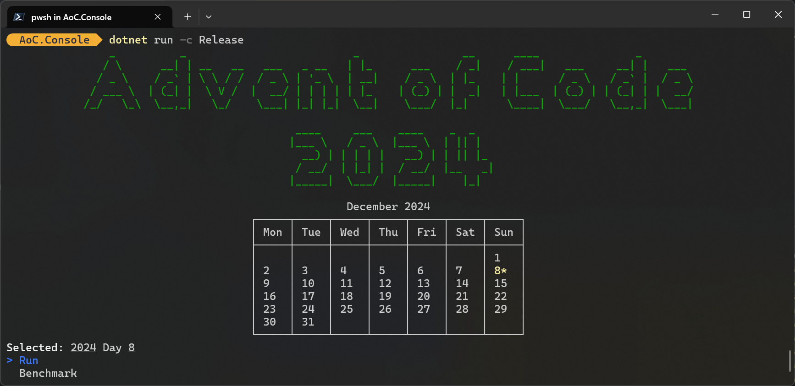

# AoC2024



Advent of code runner with support for:
* Console
* Benchmarking

Powered by source generators!

It is a rebuild from a more complex set up of my [previous AoC runner](https://github.com/Tvde1/AdventOfCode2022). Some features as being able to run all days at once, or choosing which day to run are not copied over yet.

## Running it yourself
If you want to use this tool for yourself you can fork this repository and delete all the puzzles in the year's folder.

To create a puzzle:
* Create a new class in the `Puzzles` namespace
* Implement the `IPuzzle` interface with one or two generic parameters.
* Add the `[Puzzle(2024, 1)]` attribute to the class with the year and day number.
* Add the puzzle input in the `Inputs` folder with the name `DayXX.txt`.

```csharp
[Puzzle(2024, 1)]
public class ThatOneFunnyDay : IPuzzle<int, string>
{
    public int Part1(ReadOnlySpan<char> input)
    {
        return 1234;
    }

    public int Part2(ReadOnlySpan<char> input)
    {
        return "Hello, World!";
    }
}
```
The generic parameters of the `IPuzzle` interface are for the return types of the two parts of the day.
It is also possible to specify only one value for both parts.

This generic parameter is added because most days only require you to return a number. In that case we want to benchmark the puzzle without allocating a string.

## Source Generators
The source generator is used to create benchmarks as well as embedding the puzzle input in the compiled source.